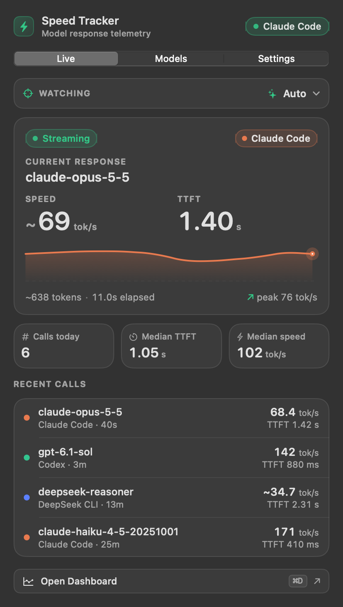
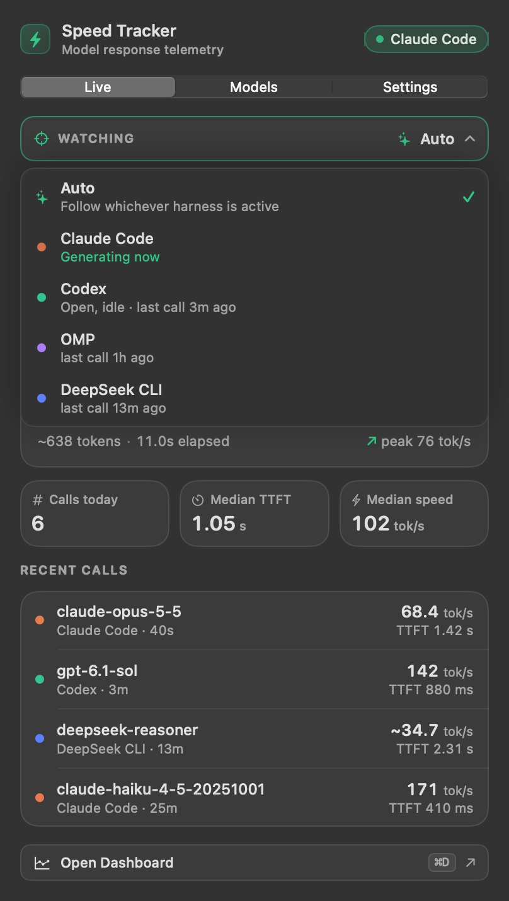
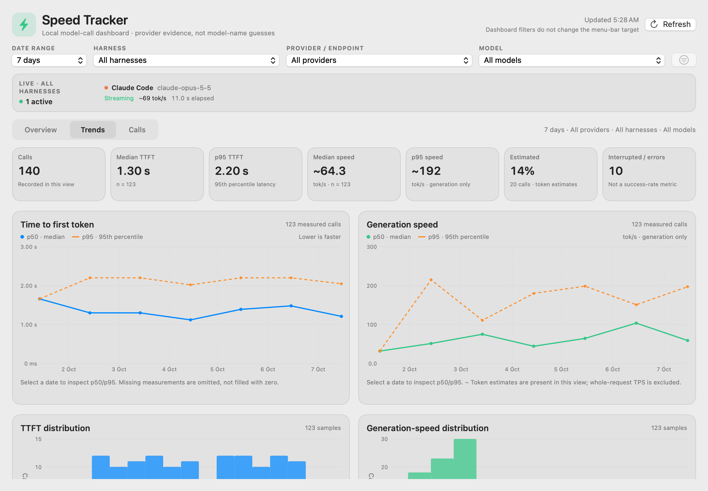

# Speed Tracker

**English** · [Tiếng Việt](README.vi.md)

A menu bar app that shows how fast the model behind your coding agent is responding:

- **TTFT**: time from sending a request to the first generated token
- **Speed**: output tokens per second

It needs no setup. Launch it, use your coding agent as usual, and the numbers appear. It reads what the agent already writes to disk and watches its network activity. It never changes an agent's configuration, and it keeps none of your prompts or replies.

macOS is the main platform. A Windows 11 version is included and is experimental (see [Windows](#windows)).

| Live | Choosing what to watch | Dashboard |
| --- | --- | --- |
|  |  |  |

*Screenshots show built-in sample data.*

## Supported harnesses

A "harness" here is the coding agent you run: Claude Code, Codex and so on. Speed Tracker works out which ones are on your machine when it starts, and only offers those.

### Read from the harness's own session data

Token counts and model names are exact, because they come from what the harness itself recorded.

| Harness | What is read | Tokens | TTFT |
| --- | --- | --- | --- |
| **Claude Code** (terminal, and the one inside the Claude desktop app) | `~/.claude/projects` session logs | exact | start of the thinking block when the reply thinks first; otherwise the first reply byte seen on the network |
| **Codex** (CLI, and the Codex inside the ChatGPT desktop app) | `~/.codex/sessions` rollout logs | exact | start of the first reasoning or message item |
| **OMP** (oh-my-pi) and **Pi** | `~/.omp/agent/sessions`, `~/.pi/agent/sessions` | exact | the harness's own measurement |
| **OpenCode** | its SQLite database, or older JSON storage | exact | older storage only; the current format does not record when a request was sent, so TTFT is left blank |
| **Gemini CLI** | `~/.gemini/tmp/…/chats` session logs | exact | arrival of the first thought; a reply with no thoughts falls back to the network |
| **Antigravity** (editor and `agy`) | `~/.gemini/antigravity/conversations` databases | exact | Antigravity's own measurement |
| **DeepSeek CLI** (`dsh`) | `~/.dsh/sessions` logs, plain or Zstandard | exact | request step to first stream event |

### Recognised by process, timed from network activity

These have no session data the app can read. Timing comes from the process's network traffic, and token counts are **estimated** from the size of the stream. Estimates are always marked with `~`.

| Harness | macOS | Windows |
| --- | --- | --- |
| Qwen Code, Aider, Goose, Crush | yes | with the optional network collector |
| Amp, Droid, Kimi CLI, Cursor CLI, Cline | yes | no |

### Anything else

Point any tool's base URL at the built-in local proxy and its streams are measured exactly. This is the only feature that needs configuration; see [Optional proxy](#optional-proxy).

### How well each has been tested

| | Status |
| --- | --- |
| Claude Code | followed live, compared against its session log |
| Codex, OMP | past sessions read from real data; Codex also seen live once |
| Antigravity | read from a real conversation; every stored timing matched the file's own timestamps |
| OpenCode, DeepSeek CLI | read from real data |
| Gemini CLI | built from the CLI's own source and covered by tests; not yet run against a real reply |
| Process-only harnesses | covered by tests; none has been run live |

## Install

### macOS

Requires macOS 14 or later, Apple silicon or Intel.

1. Download `SpeedTracker-macOS.zip` from the [latest release](https://github.com/Jackhamerp24/speed-tracker/releases/latest).
2. Unzip it and move **Speed Tracker** to `Applications`.
3. The app is not signed with an Apple developer certificate, so macOS blocks the first launch. Either right-click the app and choose **Open**, or run:

   ```bash
   xattr -dr com.apple.quarantine "/Applications/Speed Tracker.app"
   ```

A bolt appears in the menu bar. On first launch it reads the last seven days of sessions, so there are numbers straight away.

### Windows

Requires Windows 11, x64 or ARM64.

1. Download `SpeedTracker-win-x64.zip` or `SpeedTracker-win-arm64.zip` from the [latest release](https://github.com/Jackhamerp24/speed-tracker/releases/latest).
2. Extract the whole archive and run `SpeedTracker.exe`. Nothing else needs installing.
3. The app is unsigned, so SmartScreen may warn: choose **More info**, then **Run anyway**.

## Using it

**Menu bar.** One number, the speed, kept steady. It follows the stream while text arrives. While the model waits, thinks or runs a tool it holds its last value instead of dropping to zero. When the call is logged it settles on the exact figure. The bolt is filled while a call is in flight.

**Live tab.** The current call: model, harness, TTFT, speed, a sparkline, and recent calls. Click **Watching** to choose what to follow:

- **Auto** follows whichever harness is active.
- **A harness** pins the Live tab and the menu bar to that one.

Only harnesses found on this machine are listed. One counts as found when its command or app is installed, it has session data, or it is running. The list is checked at launch and refreshed while the app runs.

**Models tab.** Median TTFT and speed for each harness and model.

**Dashboard.** A window for history: provider-by-harness overview, trends, distributions and individual calls. The harness, provider and model filters narrow one another, so each offers only values that have calls with the other two. Pick a model and the harness list shrinks to the harnesses that have used it.

**Settings.** The harnesses found, launch at login, and whether to show TTFT in the menu bar.

## How the numbers are defined

| Number | Definition |
| --- | --- |
| TTFT | Request sent → first sign of generation. Thinking counts as generation, so a model that thinks first is not charged its thinking time as latency. |
| Speed | Output tokens ÷ time from the first token to the end of the response. |

Worth knowing:

- **Live values are estimates.** While a call streams, tokens are estimated from the bytes arriving. The finished record uses the harness's exact count.
- **TTFT differs a little between harnesses**, because each records something different. OMP and Antigravity report time to the first *visible* token, so hidden thinking counts as latency there.
- **Thinking tokens count as output**, as providers bill them. Speed is the model's generation rate, which can be higher than the rate text appears on screen.
- **Antigravity replies often arrive in one burst.** When a reply streams for under a second, the streaming time says nothing about the model, so speed is all output tokens over the whole call.
- **A blank is not a zero.** When a harness does not record something, the app shows nothing.

## Privacy

- Nothing leaves your machine. There is no account, no telemetry and no network service.
- From session data the app takes timestamps, token counts and model names. Those files also hold your prompts and replies; the app passes over them and stores none of it. Credential files are never opened.
- Network detection reads only per-connection byte counters. Traffic is not decrypted or intercepted.
- Call history is one line per call in `~/Library/Application Support/SpeedTracker/history.jsonl` (macOS) or `%LOCALAPPDATA%\SpeedTracker` (Windows).

## Optional proxy

The app also runs a proxy on `127.0.0.1:4141`. Pointing a tool's base URL at it measures the response stream directly, for any provider. Nothing depends on it.

```
http://127.0.0.1:4141/<route>/<rest of the path>
http://127.0.0.1:4141/_/<any https host>/<rest of the path>
```

Routes: `anthropic`, `openai`, `chatgpt`, `deepseek`, `openrouter`, `gemini`, `xai`, `groq`, `cerebras`, `mistral`, `moonshot`, `zai`, `ollama`, `lmstudio`. Add `@name` to a route to label the tool, for example `/anthropic@mytool/...`.

It listens on loopback only, refuses requests carrying a browser `Origin`, and does not proxy WebSockets.

## Windows

The Windows version shares the measurement rules and the history format with macOS, and is a separate implementation in C#.

- **Without elevation** it reads harness session data, which covers every harness in the first table above.
- **Network timing** needs the optional collector, which asks for administrator rights once you turn it on. Without it, harnesses that keep no session data are not measured.
- **Status: experimental.** Its tests pass and the packages build in CI, but the tray, the windows and the collector have not yet been checked by hand on a Windows machine. Please report what you find.

## Limits

- A harness that keeps no session data is measured from traffic alone, with estimated token counts.
- On macOS, sampling network counters launches the system `nettop` tool for each sample: once a second while a harness is open, up to ten times a second while a request waits for its first byte.
- Builds are not signed or notarised.

## Build from source

**macOS** needs the Xcode Command Line Tools; full Xcode is not required.

```bash
./Scripts/build_app.sh
```

```bash
./Scripts/test.sh
```

**Windows** needs the .NET 8 SDK.

```powershell
.\Scripts\build_windows.ps1 -Runtime win-x64
```

```powershell
dotnet run --project Windows/SpeedTracker.Smoke/SpeedTracker.Smoke.csproj -c Release
```

To see what the app detects on a Mac:

```bash
"Speed Tracker.app/Contents/MacOS/SpeedTracker" --diagnose 30
```

GitHub Actions builds and tests both apps on every push. Pushing a tag such as `v0.1.0` publishes them as a release.

## Project layout

```
Sources/SpeedTrackerCore   detection, session readers, flow tracking, history, dashboard analytics (no UI)
Sources/SpeedTracker       macOS menu bar app and dashboard
Tests/                     macOS tests
Windows/                   Windows core, app, optional collector and proxy, tests
Scripts/                   build and test scripts
AGENTS.md                  notes for contributors and coding agents: formats, decisions, pitfalls
```

## Acknowledgement

The idea of a small menu bar companion for coding agents comes from [CodexBar](https://github.com/steipete/CodexBar).
